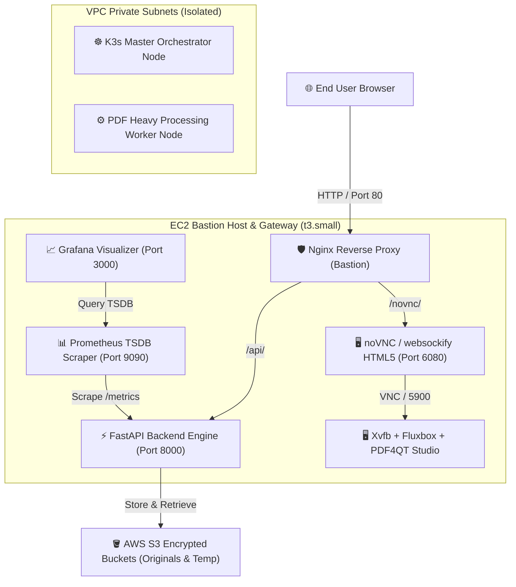
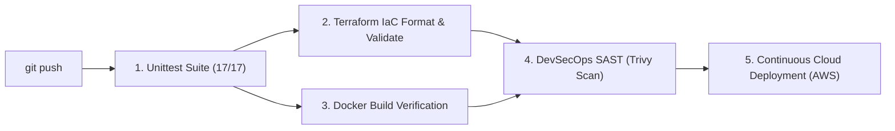

# 🦁 pdfRoar — Enterprise Cloud-Native PDF Platform & Multi-Region Suite

[](https://github.com/joanroamora/pdfRoar/actions/workflows/ci-cd.yml)
[](LICENSE)
[](terraform/)
[](.github/workflows/ci-cd.yml)

**pdfRoar** is a high-performance, enterprise-grade, cloud-native PDF management and editing platform built on modern asynchronous microservice architectures and HashiCorp Terraform Infrastructure-as-Code.

---

## 🌟 Key Platform Features

1. **⚡ PDF Merge Studio**: Seamlessly combine dozens of PDF documents into a single optimized file with ultra-fast PyMuPDF stream processing.
2. **✂️ Split & Extract Studio**: Extract precise page ranges or custom page selections (e.g., `1, 3, 5-8`) into dedicated PDF outputs.
3. **📄 Clean Text Extraction**: Instant server-side extraction of unformatted text streams for indexing, search, and NLP pipelines.
4. **📝 PDF to Microsoft Word (.DOCX) Studio**: Convert complex PDF documents directly into fully editable `.docx` Word files using PyMuPDF and python-docx.
5. **✏️ Word/Acrobat WYSIWYG Interactive Editor**: Edit text elements directly on high-resolution PDF canvas with font, size, color, and redaction controls.
6. **💻 PDF4QT Native Desktop Studio**: Full C++/Qt6 PDF4QT desktop application running live inside any modern web browser via HTML5 noVNC streaming.
7. **📈 LGTM Observability Stack**: Embedded Prometheus TSDB metrics scraper and auto-provisioned Grafana telemetry dashboards.

---

## 🏗️ Cloud Architecture Topology

The platform deploys a cost-optimized, single-region or multi-region topology on Amazon Web Services (AWS) using HashiCorp Terraform:



---

## 🌍 Multi-Environment & Multi-Region Architecture

The repository enforces a declarative multi-environment deployment model across 3 distinct AWS regions, protected by automated cost-safeguard locks:

| Environment | AWS Region | Region Name | Status | Safety Lock (`launch_safety_lock`) |
| :--- | :--- | :--- | :--- | :--- |
| **`dev`** | `us-east-1` | N. Virginia | 🟢 Active Testing | 🔓 `false` (Unlocked) |
| **`staging`** | `us-east-2` | Ohio | 🔴 Declarative Only | 🔒 `true` (LOCKED — $0.00 Cost Guard) |
| **`prod`** | `us-west-2` | Oregon | 🔴 Declarative Only | 🔒 `true` (LOCKED — $0.00 Cost Guard) |

### 🛡️ Cost Protection Safety Guard (`main.tf`)
To prevent accidental cloud charges in non-dev environments, Terraform evaluates a precondition check before planning or applying any resources:

```hcl
resource "terraform_data" "safety_guard" {
  lifecycle {
    precondition {
      condition     = var.enable_deployment == true && var.launch_safety_lock == false
      error_message = "SAFETY LOCK ENGAGED: Multi-region deployment for environment '${var.environment}' is currently LOCKED to prevent unexpected AWS cloud charges."
    }
  }
}
```

---

## 🚀 DevSecOps CI/CD Pipeline

Every push or pull request triggers an automated 5-stage DevSecOps pipeline defined in `.github/workflows/ci-cd.yml`:



1. **Unittest Suite**: Executes 17 unit and integration tests across FastAPI endpoints and PDF stream engines.
2. **Terraform IaC Validation**: Formats and validates HashiCorp HCL files for syntax correctness.
3. **Docker Verification**: Verifies container build definitions for PDF4QT and microservices.
4. **DevSecOps SAST (Trivy)**: Scans filesystem and dependencies for known CVE vulnerabilities.
5. **Cloud CD Deployment**: Automatically applies Terraform changes on `main` and publishes interactive deployment URLs into `$GITHUB_STEP_SUMMARY`.

---

## 🔒 Security Audit & Compliance

- **Zero Secret Leakage**: No AWS credentials, private keys, or API tokens are hardcoded in source files. All authentication relies on GitHub Secrets and IAM roles.
- **IAM Least Privilege**: EC2 instances authenticate to AWS S3 using scoped IAM roles (`aws_iam_instance_profile`) with server-side TLS enforcement.
- **Network Isolation**: Backend workers run inside private subnets without public IPv4 addresses, routing egress traffic through NAT Gateways.

---

## 🛠️ Local Development & Testing

### Running Tests Locally
```bash
python3 -m unittest discover -s tests -p "test_*.py"
```

### Running Backend Locally
```bash
uvicorn app_main:app --reload --port 8000
```

### Validating Multi-Environment Terraform Plans
```bash
cd terraform
terraform init -backend=false

# Test Dev Environment Plan
terraform plan -var-file=environments/dev.tfvars

# Test Staging Safety Lock (Will Abort safely)
terraform plan -var-file=environments/staging.tfvars
```

---

## 📜 License
This project is licensed under the MIT License. See [LICENSE](LICENSE) for details.
